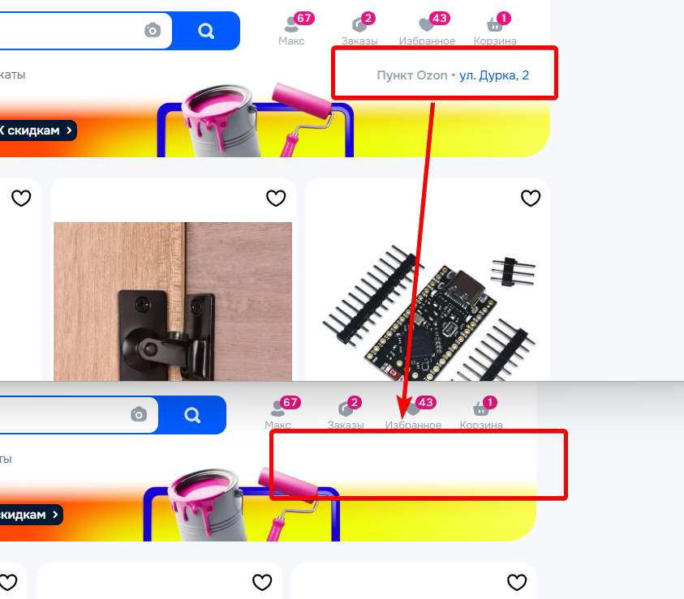
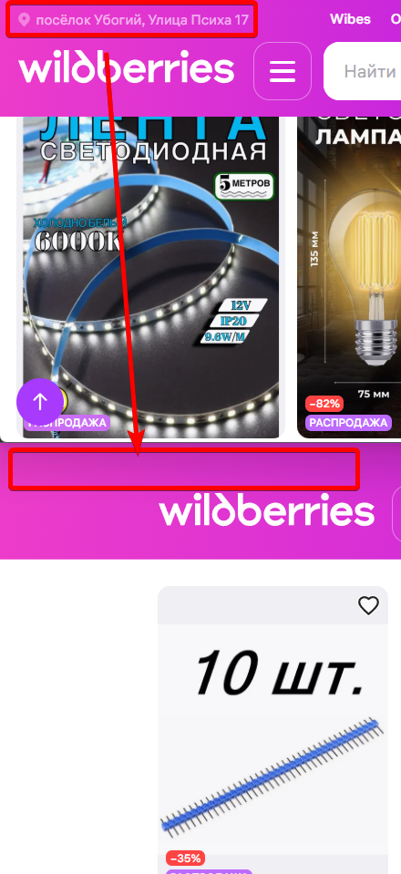

# Remove Geo Items (Ozon & Wildberries)

Краткий набор UserScript-скриптов для удаления гео‑элементов на сайтах Ozon и Wildberries.

## Что делает
- Удаляет блоки с геолокацией (geo‑элементы) на страницах Ozon и Wildberries.
- Работает внутри обычного DOM и shadow DOM.
- Отслеживает динамически добавляемые элементы через MutationObserver.
- Периодически повторяет попытки удаления и отключает наблюдатель после 20 итераций.

 
## Установка
1. Установите расширение UserScript (Tampermonkey, Violentmonkey или аналог).
2. Создайте новый скрипт и вставьте содержимое соответствующего файла.
 
 
 
  